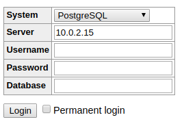

# Domain App

#### Introdução
A aplicação de dominio da plataforma é responsável por oferecer recuros de leitura e escrita na base de dados da aplicação de forma desacoplada com o modelo físico de dados, além disso permite ao usuário criar um modelo de domínio agnóstico de tecnologia todo baseado em YAML. Além do modelo de domínio abstrato é possível também criar um mapa de acesso a dados customizando assim o nome de entidade e atributos de acordo com a necessidade da aplicação

#### Estrutura do Projeto
O projeto é dividido em três grandes módulos:
* [Domain.App](/Domain.App/README.md)
* [Platform.App](/Platform.App/README.md)
* [Platform.Cli](/Platform.Cli/README.md)

Domain.App contém a aplicação de domínio onde o usuário irá definir o modelo de dados físicos baseados em YAML;

Platoform.App contém o template de tecnologia de execução na plataforma no caso nós usamos o NodeJs como template de implementação

Platform.Cli contém um projeto utilitário que compila a aplicação de domínio em YAML para uma aplicação completa NodeJS

#### Requisitos

Para executar as aplicações com sucesso você precisa instalar as seguintes ferramentas:
* [NodeJS](https://nodejs.org)
* NPM (vem junto com o NodeJS)
* [Docker](https://www.docker.com/)
* Docker compose
* PostgresSQL*

*No caso de você não possuir o Docker instalado você deve instalar o Postgres manualmente na máquina.

Caso você opte por usar o docker você pode subir o Postgres e o Adminer com o seguinte comando:
```sh
$ docker-compose up -d
```
Ao executar esse comando o docker ir√° subir um container com o Postgre, Adminer e o PgAdmin4

Após a subida dos containers você deve acessar o Postgres para criar uma base de dados.
O Adminer pode ser acessado diretamente pelo browser através do endereço:
http://localhost:8080

Observação Importante:
    ```Lembre-se de escolher o ip da sua maquina para conectar ao Postgres com Adminer, se você colocar localhost o Adminer não irá encontrar o Postgres, lembre-se que eles estão rodando em containers diferentes```
    
<p align="center">
  
</p>

Você deve criar um banco de dados chamado "app", caso queira rodar a aplicação já seguindo as configurações default

Para mais informações você pode consultar o README de cada projeto específico.


Para executar o PgAdmin4 voc√™pode acessar o browser no endere√o http://localhost:5050, voc√™dever√° entrar com o login: 

user: pgadmin4@pgadmin.org
password: admin

